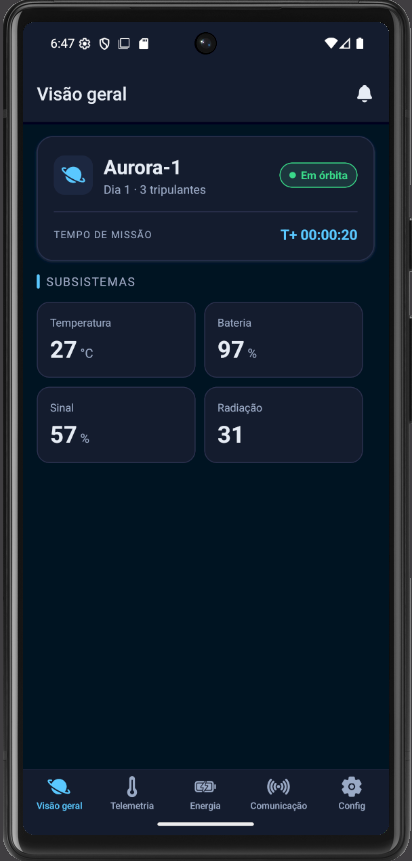
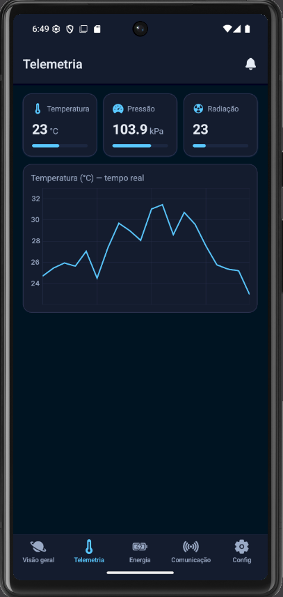
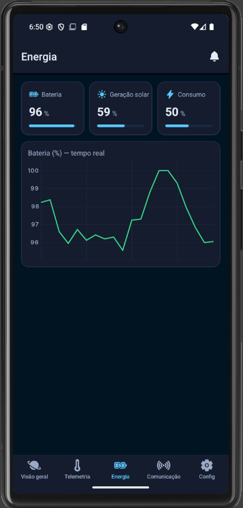
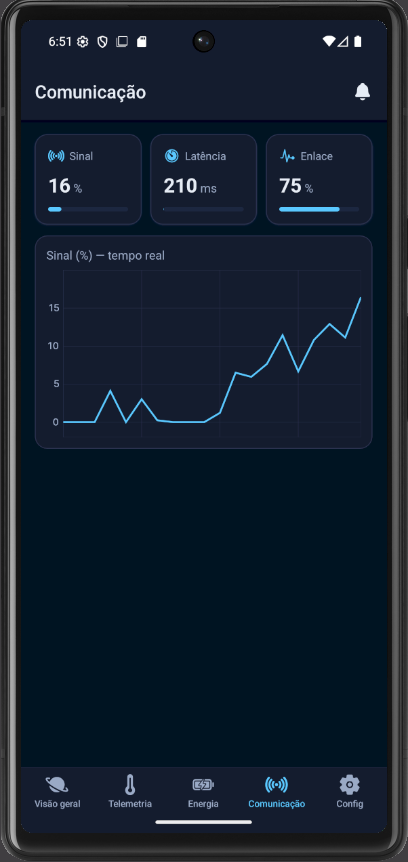
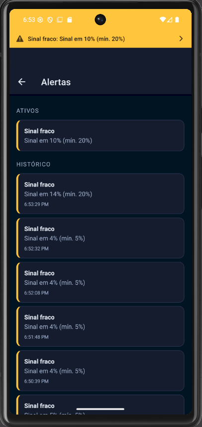
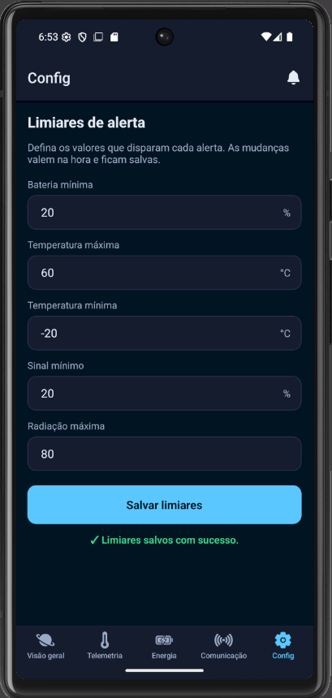

# 🛰️ Aurora MCC — Centro de Controle de Missão

### Global Solution 2026.1 — Cross-Platform Application Development | FIAP


> _LOGO DO GRUPO_

---

## 📖 Descrição

O **Aurora MCC** é uma plataforma mobile de análise preditiva para monitoramento de uma missão espacial simulada, dentro do contexto do desafio **Space Predictive Analytics**. O app coleta e processa em tempo real (simulado) dados de telemetria, energia e comunicação de uma espaçonave, exibindo-os em dashboards com cards e gráficos. Quando qualquer leitura cruza um limiar crítico configurável, o sistema gera **alertas automáticos** exibidos de forma clara na interface. O diferencial da solução é um **motor de simulação central** que alimenta toda a aplicação a partir de uma única fonte de estado, somado a uma interface estilo "painel de controle" com animações de propósito (Reanimated) que reforçam a leitura de status crítico.

---

## 👥 Equipe

| Nome | RM |
|------|----|
| [Luiz Claro Lima] | RM563014 |
| [Gabriel Nacarelli Pinheiro] | RM565298 |

---

## 📸 Telas do Aplicativo

### Home — Dashboard Principal


Visão geral da missão: card-herói com status, cronômetro de tempo de missão (T+) e indicadores resumidos de temperatura, bateria, sinal e radiação.

### Dashboard de Sensores (Telemetria)


Cards de temperatura, pressão e radiação com barras de nível, e gráfico de linha com as leituras dos sensores em tempo real simulado.

### Dashboard de Energia


Indicadores de carga da bateria, geração dos painéis solares e consumo dos sistemas, com gráfico do nível de bateria ao longo do tempo.

### Dashboard de Comunicação


Status do enlace de telemetria, latência e qualidade do sinal, com gráfico do sinal em tempo real.

### Alertas


Lista de alertas ativos gerados automaticamente por limiar crítico, com nível de severidade, mais o histórico de alertas persistido.

### Configurações / Formulário


Formulário de configuração dos limiares de alerta, com inputs controlados, validação e feedback visual de erro.

---

## ⚙️ Funcionalidades

- [x] Navegação com **Expo Router** (Tabs + Stack)
- [x] Mínimo de 3 dashboards com dados simulados distintos (telemetria, energia, comunicação)
- [x] Dashboards com **cards, barras de nível e gráficos** em tempo real (simulado)
- [x] **Context API** com `useReducer` para o estado global da missão, consumida em múltiplas telas
- [x] **Sistema de alertas** automáticos com base em limiares críticos
- [x] **Persistência com AsyncStorage** (limiares de alerta e histórico de alertas)
- [x] **Formulário** de configuração de limiares com validação e feedback de erro
- [x] Banner de alerta global e animações com **Reanimated** (entrada de cards, pulso de alerta, feedback de formulário)
- [x] Identidade visual temática (tema escuro espacial, ícones, indicadores)

---

## 🧰 Tecnologias

- **React Native + Expo** (SDK 54)
- **Expo Router** — navegação por arquivos (Tabs + Stack)
- **Context API** + `useReducer` / `useState` / `useEffect` — estado global
- **AsyncStorage** — persistência de dados
- **victory-native** + `@shopify/react-native-skia` + `@expo-google-fonts/inter` — gráficos
- **react-native-reanimated** — animações
- **@expo/vector-icons** (Ionicons) — ícones
- **JavaScript**

---

## ▶️ Como Executar

### Pré-requisitos
- **Node.js 20.19.4** ou superior (exigido pelo Expo SDK 54)
- Aplicativo **Expo Go** instalado no celular (iOS ou Android), ou um emulador

### Instalação

```bash
# Clone o repositório
git clone https://github.com/[seu-usuario]/[seu-repo].git

# Acesse a pasta do projeto
cd [seu-repo]

# Instale as dependências
npm install

# Inicie o projeto (com cache limpo)
npx expo start -c
```

Escaneie o QR Code com o **Expo Go** para rodar no dispositivo físico, ou pressione `a` (Android) / `i` (iOS) para abrir no emulador.

---

## 🎬 Vídeo de Demonstração

[Clique aqui para assistir à demonstração](https://youtube.com/...)

> _LINK_

---
